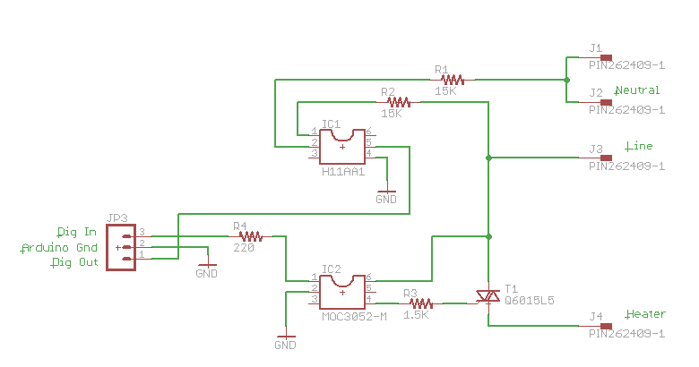
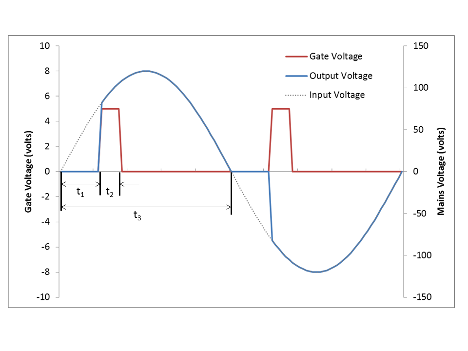

# AC Phase Control (Arduino)
One method of controlling power to AC circuits uses a TRIAC to turn the power on and off at precisely timed intervals that are synchronized with the AC signal. This method is called AC phase control. It is the method used in many light dimmer and heater power control circuits.

# See Also
https://playground.arduino.cc/Code/ACPhaseControl

# Circuit
Using an Arduino microcontroller with some simple circuitry, we can monitor the AC wave to determine the proper time to turn the power on and off with the TRIAC (a 10kOhm pull-up resistor is needed at the H11AA1 pin 5). The circuit I used to do this is shown below.



The circuit consists of an opto-isolated zero-crossing detector and an opto-isolated trigger circuit for the TRIAC. The opto-isolators are necessary to keep the low voltage signal circuits away from the power circuits and provide an appropriate level of safety. As with all circuits involving mains voltage, make sure you know what you are doing.

# Theory of Operation
The zero-crossing detection circuit provides a 5V pulse every time the AC signal crosses zero volts. We detect this with the Arduino and leverage interrupts to time the trigger circuit precisely in synchronization with these zero-crossing events. The method for power control is shown in the diagram below.



Once a zero crossing is detected, the TRIAC remains off for a controlled amount of time (t1) . The longer this time is, the less power the AC circuit receives. Once the “off-time”, t1 has elapsed, the microcontroller turns on the TRIAC by applying a voltage to the gate (shown in red). Once turned on, the TRIAC will remain on even after the gate voltage has been removed. It will turn off if the gate voltage is zero the next time the AC wave crosses zero. Because of this, we do not need to take care to turn the TRIAC off when the AC signal crosses zero again. All we need to do is to ensure that the TRIAC gets turned off inside of the period of ½ wave (t3). The duration of the gate pulse (t2) is determined by a minimum requirement of the traic. If this pulse is too short, the traic will not fire Once the second zero crossing occurs, since there is no voltage on the gate, the TRIAC remains off until triggered again in the next ½ cycle. The net result here is that we “chop” parts of the wave out resulting in lower average power. This is essentially how one accomplishes “PWM” control of an AC wave.

We will be using interrupts and the Arduino timer to precisely control the timing of the TRIAC gate. To get a feel for the time intervals, we need to look at the AC signal and the Arduino clock.

The AC signal (in the US anyway) is 60 Hz. What this means is that the AC signal crosses zero, reaches peak positive voltage, crosses zero, reaches peak negative voltage and returns to zero 60 times each second. The period (length of time this takes) is 1/60 or 0.01667 seconds (16.67 milliseconds). A half cycle (the time between two zero-crossings) occurs in 8.33 milliseconds. This is t3 in the figure above.

The Arduino clock runs at 16 MHz, which is 16,000,000 cycles per second: one clock cycle takes 0.0625 microseconds. A single half cycle of the 60 Hz AC signal contains 133,333 clock cycles. This is important because we will be determining the time intervals by clock counts in the Arduino code, not by seconds.

There is quite a bit of good information on use of interrupts with the Arduino out on the web so I won’t cover that in much detail here. Basically the way an interrupt works is that when some event happens (either internal or external to the microprocessor), the microprocessor immediately stops what it is doing to “service” the interrupt. This allows the microprocessor to handle very time sensitive events such as the AC Phase control task here.


# PhaseControl.ino
```cpp
// AC Control V1.1
//
// This Arduino sketch is for use with the heater 
// control circuit board which includes a zero 
// crossing detect function and an opto-isolated TRIAC.
//
// AC Phase control is accomplished using the internal 
// hardware timer1 in the Arduino
//
// Timing Sequence
// * timer is set up but disabled
// * zero crossing detected on pin 2
// * timer starts counting from zero
// * comparator set to "delay to on" value
// * counter reaches comparator value
// * comparator ISR turns on TRIAC gate
// * counter set to overflow - pulse width
// * counter reaches overflow
// * overflow ISR turns off TRIAC gate
// * TRIAC stops conducting at next zero cross


// The hardware timer runs at 16MHz. Using a
// divide by 256 on the counter each count is 
// 16 microseconds.  1/2 wave of a 60Hz AC signal
// is about 520 counts (8,333 microseconds).


#include <avr/io.h>
#include <avr/interrupt.h>

#define DETECT 2  //zero cross detect
#define GATE 9    //TRIAC gate
#define PULSE 4   //trigger pulse width (counts)
int i=483;

void setup(){

  // set up pins
  pinMode(DETECT, INPUT);     //zero cross detect
  digitalWrite(DETECT, HIGH); //enable pull-up resistor
  pinMode(GATE, OUTPUT);      //TRIAC gate control

  // set up Timer1 
  //(see ATMEGA 328 data sheet pg 134 for more details)
  OCR1A = 100;      //initialize the comparator
  TIMSK1 = 0x03;    //enable comparator A and overflow interrupts
  TCCR1A = 0x00;    //timer control registers set for
  TCCR1B = 0x00;    //normal operation, timer disabled


  // set up zero crossing interrupt
  attachInterrupt(0,zeroCrossingInterrupt, RISING);    
    //IRQ0 is pin 2. Call zeroCrossingInterrupt 
    //on rising signal

}  

//Interrupt Service Routines

void zeroCrossingInterrupt(){ //zero cross detect   
  TCCR1B=0x04; //start timer with divide by 256 input
  TCNT1 = 0;   //reset timer - count from zero
}

ISR(TIMER1_COMPA_vect){ //comparator match
  digitalWrite(GATE,HIGH);  //set TRIAC gate to high
  TCNT1 = 65536-PULSE;      //trigger pulse width
}

ISR(TIMER1_OVF_vect){ //timer1 overflow
  digitalWrite(GATE,LOW); //turn off TRIAC gate
  TCCR1B = 0x00;          //disable timer stopd unintended triggers
}

void loop(){ // sample code to exercise the circuit

i--;
OCR1A = i;     //set the compare register brightness desired.
if (i<65){i=483;}                      
delay(15);                             

}
```


